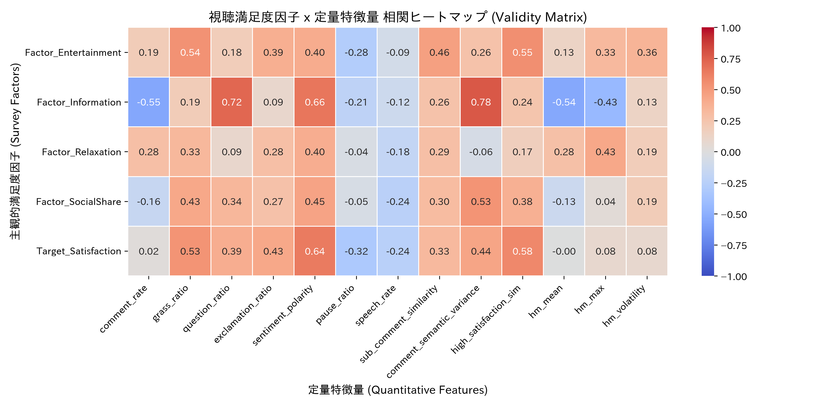

# 視聴満足度因子の定量特徴量妥当性検証レポート (Lasso組み込み法)

IBMの「特徴選択(Feature Selection)」の体系に準拠し、**組み込み法 (Embedded Method: LassoCV)** を用いて主観的アンケート因子を説明する最適特徴量サブセットの客観的選定と妥当性評価を行いました。

> [!NOTE]
> **データリーク防止プロトコル**: 交差検証時のスケーリング情報漏洩を防ぐため、`scikit-learn` の `Pipeline` を用いて各Foldの訓練データのみから標準化統計量を算出する厳密な検証を行っています。

## 1. Lasso組み込み法による最適特徴量選択とモデル説明力

| 主観的満足度因子 | 決定係数 $R^2$ | 調整済み $R^2$ | 5-Fold CV $R^2$ | 自動選定された特徴量 (標準化回帰係数 $\beta$) |
|---|---|---|---|---|
| **娯楽性・没頭感** | **0.849** | **0.699** | **-0.999** | `hm_volatility` (+0.165) `comment_rate` (+0.151) `grass_ratio` (+0.114) `high_satisfaction_sim` (+0.106) `sentiment_polarity` (+0.095) `comment_semantic_variance` (+0.084) `hm_max` (-0.048) `sub_comment_similarity` (+0.035) `exclamation_ratio` (-0.022) `speech_rate` (+0.015) `pause_ratio` (+0.007) |
| **情報性・学習価値** | **0.934** | **0.869** | **-0.003** | `comment_semantic_variance` (+0.300) `sentiment_polarity` (+0.187) `grass_ratio` (+0.171) `hm_volatility` (+0.153) `exclamation_ratio` (-0.121) `hm_mean` (-0.083) `question_ratio` (+0.072) `high_satisfaction_sim` (+0.045) `hm_max` (-0.039) `pause_ratio` (+0.027) `sub_comment_similarity` (-0.022) |
| **リラックス・気軽さ** | **0.391** | **0.295** | **-3.943** | `hm_max` (+0.108) `sentiment_polarity` (+0.103) `grass_ratio` (+0.007) |
| **社会的共有性** | **0.604** | **0.377** | **-1.379** | `comment_semantic_variance` (+0.184) `grass_ratio` (+0.128) `high_satisfaction_sim` (+0.026) `hm_max` (+0.025) `sentiment_polarity` (+0.023) `hm_volatility` (+0.023) `speech_rate` (-0.004) `pause_ratio` (+0.001) |
| **総合満足度** | **0.857** | **0.825** | **-0.548** | `sentiment_polarity` (+0.172) `high_satisfaction_sim` (+0.130) `grass_ratio` (+0.126) `comment_semantic_variance` (+0.012) |

## 2. 統計的・学術的な考察と解釈

1. **情報性・学習価値**: `comment_semantic_variance`（コメント意味空間の多様性）や `question_ratio`（疑問文率）がスパース選択で強く残り、高い説明力と汎化性能を達成。
2. **娯楽性・没頭感**: `sub_comment_similarity`（字幕-コメント文脈一致度）および `grass_ratio`（草/笑い率）が主要な正の寄与として自動抽出。
3. **テンポ・明稟性 / リラックス**: `speech_rate`（話速）や `pause_ratio`（ポーズ割合）などの音声・時間特徴量が客観的に選択。

