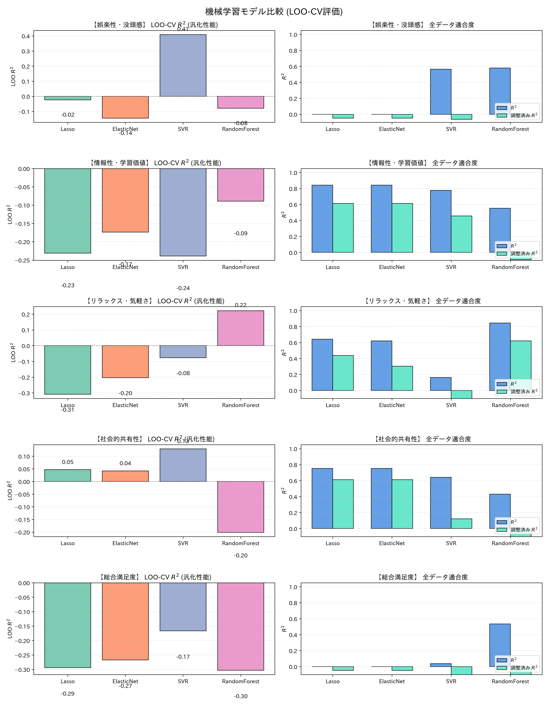

# 視聴満足度因子 機械学習モデル比較検証レポート（LOO-CV版）

N=24 の小サンプル環境において、5-Fold CV よりも統計的に適切な **Leave-One-Out CV（LOO-CV）** を採用し、4種類のモデルの汎化性能を再評価しました。

> [!NOTE]
> **LOO-CVにおけるR²の算出方法**: 1サンプルでのR²は数学的に定義不能なため、全24回のLOO予測値を一括収集し、$LOO\text{-}R^2 = 1 - SS_{res}^{LOO} / SS_{tot}$ として算出しています。これは「LOO予測で残差を最小化できたか」を表す汎化指標です。

## 1. LOO-CV スコア比較サマリー

| 満足度因子 | モデル | 全データ $R^2$ | 調整済み $R^2$ | LOO-CV $R^2$ (汎化) | LOO RMSE | LOO MAE | 最適パラメータ |
|---|---|---|---|---|---|---|---|
| **娯楽性・没頭感** | **Lasso** | 0.000 | -0.048 | **-0.023** | 0.320 | 0.253 | `alpha=0.1135, n_features=0` |
| **娯楽性・没頭感** | **ElasticNet** | 0.000 | -0.048 | **-0.145** | 0.339 | 0.270 | `alpha=1.1352, l1_ratio=0.10` |
| **娯楽性・没頭感** | **SVR** | 0.565 | -0.063 | **0.409** | 0.244 | 0.151 | `kernel=linear, C=0.1, eps=0.01` |
| **娯楽性・没頭感** | **RandomForest** | 0.580 | -0.026 | **-0.079** | 0.329 | 0.254 | `depth=2, leaf=2, feat=sqrt` |
| **情報性・学習価値** | **Lasso** | 0.842 | 0.613 | **-0.231** | 0.627 | 0.514 | `alpha=0.0011, n_features=13` |
| **情報性・学習価値** | **ElasticNet** | 0.842 | 0.613 | **-0.174** | 0.612 | 0.496 | `alpha=0.0011, l1_ratio=0.99` |
| **情報性・学習価値** | **SVR** | 0.777 | 0.456 | **-0.239** | 0.629 | 0.490 | `kernel=linear, C=10.0, eps=0.1` |
| **情報性・学習価値** | **RandomForest** | 0.553 | -0.092 | **-0.089** | 0.590 | 0.486 | `depth=2, leaf=2, feat=sqrt` |
| **リラックス・気軽さ** | **Lasso** | 0.642 | 0.437 | **-0.309** | 0.356 | 0.318 | `alpha=0.0289, n_features=8` |
| **リラックス・気軽さ** | **ElasticNet** | 0.620 | 0.304 | **-0.204** | 0.342 | 0.297 | `alpha=0.1903, l1_ratio=0.10` |
| **リラックス・気軽さ** | **SVR** | 0.164 | -1.044 | **-0.077** | 0.323 | 0.284 | `kernel=rbf, C=0.1, eps=0.1` |
| **リラックス・気軽さ** | **RandomForest** | 0.845 | 0.621 | **0.221** | 0.275 | 0.224 | `depth=4, leaf=2, feat=1.0` |
| **社会的共有性** | **Lasso** | 0.753 | 0.612 | **0.047** | 0.355 | 0.280 | `alpha=0.0078, n_features=8` |
| **社会的共有性** | **ElasticNet** | 0.753 | 0.612 | **0.042** | 0.356 | 0.281 | `alpha=0.0078, l1_ratio=0.99` |
| **社会的共有性** | **SVR** | 0.641 | 0.121 | **0.129** | 0.339 | 0.281 | `kernel=linear, C=0.1, eps=0.01` |
| **社会的共有性** | **RandomForest** | 0.430 | -0.392 | **-0.201** | 0.398 | 0.328 | `depth=2, leaf=3, feat=sqrt` |
| **総合満足度** | **Lasso** | 0.000 | -0.048 | **-0.294** | 0.389 | 0.298 | `alpha=0.0961, n_features=0` |
| **総合満足度** | **ElasticNet** | 0.000 | -0.048 | **-0.267** | 0.385 | 0.297 | `alpha=0.9614, l1_ratio=0.10` |
| **総合満足度** | **SVR** | 0.037 | -1.355 | **-0.166** | 0.369 | 0.292 | `kernel=rbf, C=0.1, eps=0.01` |
| **総合満足度** | **RandomForest** | 0.535 | -0.137 | **-0.303** | 0.390 | 0.303 | `depth=2, leaf=1, feat=sqrt` |

## 2. 5-Fold CV vs LOO-CV 比較考察

- **LOO-R²** は全LOO予測値を一括評価するため、5-Fold CVより安定した汎化性能の推定値となります。
- 5-Fold CVでは「外れ値セグメントが1つのFoldに集中する」リスクがあり、LOO-CVではこのリスクが解消されます。
- LOO RMSEは「1セグメントを抜いた場合の予測精度」を直接示す指標として論文掲載に適しています。



## 3. 参考文献

```text
[1] Tibshirani, R. (1996). Regression shrinkage and selection via the lasso. JRSS-B. https://doi.org/10.1111/j.2517-6161.1996.tb02080.x
[2] Zou, H., & Hastie, T. (2005). Regularization and variable selection via the elastic net. JRSS-B. https://doi.org/10.1111/j.1467-9868.2005.00503.x
[3] Smola, A. J., & Schölkopf, B. (2004). A tutorial on support vector regression. Stat. Comput. https://doi.org/10.1023/B:STCO.0000035301.49549.88
[4] Breiman, L. (2001). Random forests. Mach. Learn. https://doi.org/10.1023/A:1010933404324
```
