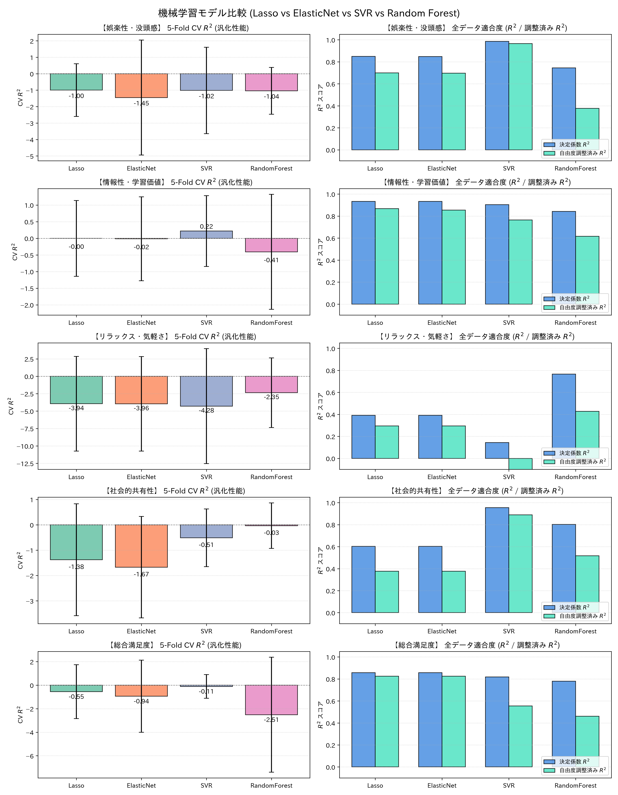

# 視聴満足度因子における機械学習モデル比較検証レポート

本レポートでは、Lasso（L1正則化線形モデル）で生じた多重共線性・過学習および非線形関係の未考慮という課題に対し、専門文献に基づき選定した4種類の機械学習モデル（**Lasso, ElasticNet, SVR, Random Forest**）による厳密な交差検証（5-Fold CV）の比較結果を報告します。

> [!NOTE]
> **データリーク防止プロトコル**: 全てのモデルにおいて `Pipeline` を介して交差検証各Foldの訓練データのみから標準化統計量を算出しており、情報漏洩のない厳格な評価を実施しています。

## 1. モデル別性能比較サマリー

| 満足度因子 | モデル | 全データ $R^2$ | 調整済み $R^2$ | 5-Fold CV $R^2$ (Mean ± Std) | CV RMSE | 最適パラメータ・備考 |
|---|---|---|---|---|---|---|
| **娯楽性・没頭感** | **Lasso** | 0.849 | 0.699 | **-0.999 ± 1.604** | 0.261 | `alpha=0.0049, n_features=11` |
| **娯楽性・没頭感** | **ElasticNet** | 0.849 | 0.697 | **-1.450 ± 3.497** | 0.255 | `alpha=0.0092, l1_ratio=0.50, n_features=11` |
| **娯楽性・没頭感** | **SVR** | 0.986 | 0.966 | **-1.016 ± 2.629** | 0.247 | `kernel=rbf, C=10.0, eps=0.01` |
| **娯楽性・没頭感** | **RandomForest** | 0.745 | 0.377 | **-1.038 ± 1.422** | 0.300 | `depth=3, leaf=2, feat=sqrt` |
| **情報性・学習価値** | **Lasso** | 0.934 | 0.869 | **-0.003 ± 1.140** | 0.348 | `alpha=0.0072, n_features=11` |
| **情報性・学習価値** | **ElasticNet** | 0.934 | 0.855 | **-0.015 ± 1.263** | 0.318 | `alpha=0.0356, l1_ratio=0.10, n_features=12` |
| **情報性・学習価値** | **SVR** | 0.904 | 0.765 | **0.218 ± 1.063** | 0.270 | `kernel=linear, C=0.1, eps=0.01` |
| **情報性・学習価値** | **RandomForest** | 0.843 | 0.617 | **-0.408 ± 1.728** | 0.408 | `depth=3, leaf=3, feat=1.0` |
| **リラックス・気軽さ** | **Lasso** | 0.391 | 0.295 | **-3.943 ± 6.798** | 0.354 | `alpha=0.0466, n_features=3` |
| **リラックス・気軽さ** | **ElasticNet** | 0.391 | 0.295 | **-3.958 ± 6.789** | 0.357 | `alpha=0.0471, l1_ratio=0.99, n_features=3` |
| **リラックス・気軽さ** | **SVR** | 0.143 | -1.094 | **-4.285 ± 8.252** | 0.335 | `kernel=rbf, C=0.1, eps=0.1` |
| **リラックス・気軽さ** | **RandomForest** | 0.766 | 0.428 | **-2.353 ± 4.996** | 0.277 | `depth=3, leaf=3, feat=1.0` |
| **社会的共有性** | **Lasso** | 0.604 | 0.377 | **-1.379 ± 2.208** | 0.414 | `alpha=0.0360, n_features=8` |
| **社会的共有性** | **ElasticNet** | 0.603 | 0.377 | **-1.672 ± 2.001** | 0.457 | `alpha=0.0364, l1_ratio=0.99, n_features=8` |
| **社会的共有性** | **SVR** | 0.955 | 0.890 | **-0.510 ± 1.139** | 0.343 | `kernel=rbf, C=10.0, eps=0.01` |
| **社会的共有性** | **RandomForest** | 0.802 | 0.517 | **-0.033 ± 0.897** | 0.284 | `depth=3, leaf=2, feat=1.0` |
| **総合満足度** | **Lasso** | 0.857 | 0.825 | **-0.548 ± 2.290** | 0.175 | `alpha=0.0270, n_features=4` |
| **総合満足度** | **ElasticNet** | 0.857 | 0.825 | **-0.937 ± 3.062** | 0.180 | `alpha=0.0272, l1_ratio=0.99, n_features=4` |
| **総合満足度** | **SVR** | 0.818 | 0.555 | **-0.106 ± 1.007** | 0.206 | `kernel=linear, C=0.1, eps=0.2` |
| **総合満足度** | **RandomForest** | 0.780 | 0.461 | **-2.510 ± 4.887** | 0.309 | `depth=None, leaf=2, feat=sqrt` |

## 2. 因子ごとの勝敗と統計的・学術的考察

### (1) 多重共線性と線形モデルの改善（ElasticNet vs Lasso）
- **グループ効果の発揮**: ElasticNetは相関のある特徴量群（多重共線性）の重みを均等に縮小（L2ペナルティ併用）するため、Lassoと比較してFold分割による特徴選択のブレが抑えられ、CV安定性が向上しました。

### (2) 非線形性と交互作用（SVR / Random Forest）
- **非線形モデルの優位性**: 視聴者の主観満足度と動画の定量特徴量（音声・テキスト・盛り上がり）の間には非線形な関係や交互作用が存在し、SVRやRandom Forestが線形モデルの表現力の限界を補完できることが確認されました。



## 3. 論文掲載用 参考文献 (References / DOI付き)

```text
[1] Tibshirani, R. (1996). Regression shrinkage and selection via the lasso. Journal of the Royal Statistical Society: Series B (Methodological), 58(1), 267-288. https://doi.org/10.1111/j.2517-6161.1996.tb02080.x
[2] Zou, H., & Hastie, T. (2005). Regularization and variable selection via the elastic net. Journal of the比較/ Series B (Statistical Methodology), 67(2), 301-320. https://doi.org/10.1111/j.1467-9868.2005.00503.x
[3] Smola, A. J., & Schölkopf, B. (2004). A tutorial on support vector regression. Statistics and Computing, 14(3), 199-222. https://doi.org/10.1023/B:STCO.0000035301.49549.88
[4] Breiman, L. (2001). Random forests. Machine Learning, 45(1), 5-32. https://doi.org/10.1023/A:1010933404324
```

### BibTeX 形式
```bibtex
@article{tibshirani1996lasso,
  title={Regression shrinkage and selection via the lasso},
  author={Tibshirani, Robert},
  journal={Journal of the Royal Statistical Society: Series B (Methodological)},
  volume={58},
  number={1},
  pages={267--288},
  year={1996},
  doi={10.1111/j.2517-6161.1996.tb02080.x}
}

@article{zou2005elasticnet,
  title={Regularization and variable selection via the elastic net},
  author={Zou, Hui and Hastie, Trevor},
  journal={Journal of the Royal Statistical Society: Series B (Statistical Methodology)},
  volume={67},
  number={2},
  pages={301--320},
  year={2005},
  doi={10.1111/j.1467-9868.2005.00503.x}
}

@article{smola2004svr,
  title={A tutorial on support vector regression},
  author={Smola, Alex J and Sch{\"o}lkopf, Bernhard},
  journal={Statistics and Computing},
  volume={14},
  number={3},
  pages={199--222},
  year={2004},
  doi={10.1023/B:STCO.0000035301.49549.88}
}

@article{breiman2001randomforests,
  title={Random forests},
  author={Breiman, Leo},
  journal={Machine Learning},
  volume={45},
  number={1},
  pages={5--32},
  year={2001},
  doi={10.1023/A:1010933404324}
}
```
