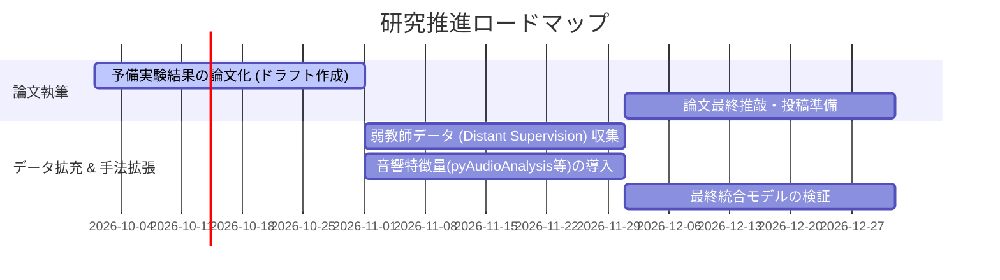

# 今後の研究方針・ロードマップ (Research Roadmap)

本ドキュメントは、IPSJ（情報処理学会）論文誌投稿および修士/卒業研究完了に向けた今後の実験・検証計画を定めたものである。

---

## 1. 全体タイムライン

---

## 2. 重点推進項目

### 重点1: 弱教師学習 (Distant Supervision / 疑似データ生成) による規模拡大
- **課題**: 被験者アンケートの大規模化が困難（コスト・工数）。
- **アプローチ**:
  - YouTube上の大量の配信アーカイブからセグメントを切り出し。
  - 公開シグナル（高評価率、コメント感情スコア、再生維持率）から主観スコアの「疑似教師ラベル (Pseudo Labels)」を自動付与。
  - 疑似データで事前学習 (Pre-training) $\to$ 24セグメントのアンケート正解データで微調整 (Fine-tuning)。

### 重点2: マルチモーダル特徴量の拡張（音響特徴量の導入）
- **現状**: コメント・テキスト・ヒートマップの3系統（13次元）。
- **拡張**:
  - 発話ピッチ変動、話速、沈黙(Pause)比率、音量エネルギー（RMS）、笑い声検出。
  - 特に「リラックス・気軽さ」因子の精度改善 ($R^2: 0.204 \to 0.50$ 目標) を図る。

### 重点3: セグメンテーション評価指標との統合
- セグメンテーション境界検出の精度評価（$P_k$, $WindowDiff$）と満足度推定スコアを結合し、自動ハイライト抽出・チャプター分割システムの有用性を検証。

---

## 3. 論文構成案 (IPSJ想定)

1. **緒論**: ライブ配信アーカイブ視聴の増加と効率的ブラウジングの必要性
2. **関連研究**: 動画要約、コメント分析、マルチモーダル満足度推定
3. **データセット**: ライブ配信セグメント収集と因子分析による満足度構造化
4. **提案手法**: マルチモーダル特徴抽出 + SVR / 弱教師学習パイプライン
5. **評価実験**: LOO-CVによる推定精度比較、特徴量重要度分析
6. **考察**: 因子ごとの有効特徴量と限界
7. **結言**: 今後の展望
